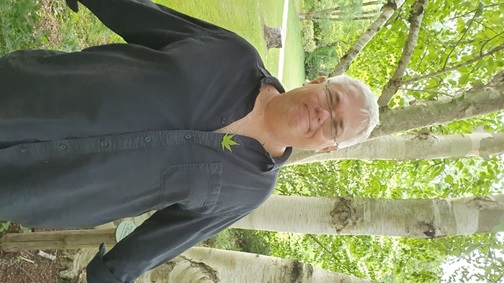

Je vous accompagne à toutes les étapes de votre projet minier :

- **validation de votre projet**
- **préparation logistique**
- **aménagement du site**
- **production**

Mes connaissances et mon expérience importante avec de multiples acteurs, privés, publics, locaux et internationaux me permettra de répondre à tous vos questionnements scientifiques, logistiques et administratifs.

---

### Étude et validation du projet minier

Je mange des dossiers de projet au petit-déjeuner, au goûter et au dîner. Le déjeuner est réservé aux TPs de mes étudiants quand j'en ai, et à la sieste quand je n'en ai pas.

Voici une phrase qui vous convaincra que je sais de quoi je parle :

> **别担心，我是一名医生。**

### Préparation logistique et ressources humaines

Je connais des gars qui bossent bien et des gars qui coûtent pas cher. Ce ne sont pas les mêmes personnes. Et une fois qu'on sait faire la différence, on atteint la qualité.

> C'est bon les gars, on a reçu la pelle mécanique neuve. Je m'occupe de transférer le nouveau moteur dans la pelle mécanique d'occasion qui nous a lâché. - *quelqu'un de pas cher*

> Il est où ce gland que je lui mette un coup de godet ? - *un chef*

> Vous inquiétez pas chef, je l'ai rangé sous le godet de la vieille pelle. On a repris le boulot avec la nouvelle et on a mis l'ancienne à l'abri en attendant de voir si vous vouliez commander des pièces de rechange pour. Vous voulez un café chef ? - *quelqu'un de compétent*

Je sais aussi vous conseiller sur le matériel et les fournisseurs qui vous épargneront ces situations le plus longtemps possible.

### Aménagement du site

Mettez des posters de moi dans le bureau pour recevoir les investisseurs, ça fait toujours son effet.

### Extraction et production

Caillous -> Machine -> Jolis caillous.

Ça sonne simple, mais c'est uniquement parce qu'on peut difficilement simplifier plus. Croyez-moi, vous avez besoin de mon aide et je peux vous l'apporter.